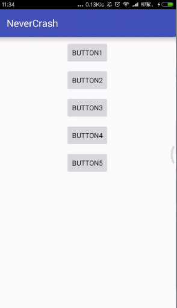

# NeverCrash
[](https://raw.githubusercontent.com/jenly1314/NeverCrash/master/app/app-release.apk)
[](https://jitpack.io/#jenly1314/NeverCrash)
[](https://opensource.org/licenses/mit-license.php)
[](http://blog.csdn.net/jenly121)

NeverCrash for Android 一个全局捕获Crash的库。信NeverCrash，永不Crash。

## Gif 展示


## 引入

### Maven：
```maven
<dependency>
  <groupId>com.king.thread</groupId>
  <artifactId>nevercrash</artifactId>
  <version>1.0.0</version>
  <type>pom</type>
</dependency>
```
### Gradle:
```gradle
compile 'com.king.thread:nevercrash:1.0.0'
```
### Lvy:
```lvy
<dependency org='com.king.thread' name='nevercrash' rev='1.0.0'>
  <artifact name='$AID' ext='pom'></artifact>
</dependency>
```

###### 如果Gradle出现compile失败的情况，可以在Project的build.gradle里面添加如下：（也可以使用上面的GitPack来complie）
```gradle
allprojects {
    repositories {
        maven { url 'https://dl.bintray.com/jenly/maven' }
    }
}
```

## 示例

核心代码(大道至简)
```Java
NeverCrash.init(CrashHandler);
```

代码示例
```Java
public class App extends Application {

    @Override
    public void onCreate() {
        super.onCreate();
        NeverCrash.init(new NeverCrash.CrashHandler() {
            @Override
            public void uncaughtException(Thread t, Throwable e) {
                Log.d("Jenly", Log.getStackTraceString(e));
//                e.printStackTrace();
                showToast(e.getMessage());


            }
        });
    }

    private void showToast(final String text){

        new Handler(Looper.getMainLooper()).post(new Runnable() {
            @Override
            public void run() {
                Toast.makeText(getApplicationContext(),text,Toast.LENGTH_SHORT).show();
            }
        });
    }

}
```

## 关于我
   Name: Jenly

   Email: jenly1314@gmail.com / jenly1314@vip.qq.com

   CSDN: http://blog.csdn.net/jenly121

   Github: https://github.com/jenly1314

   微信公众号:

   
